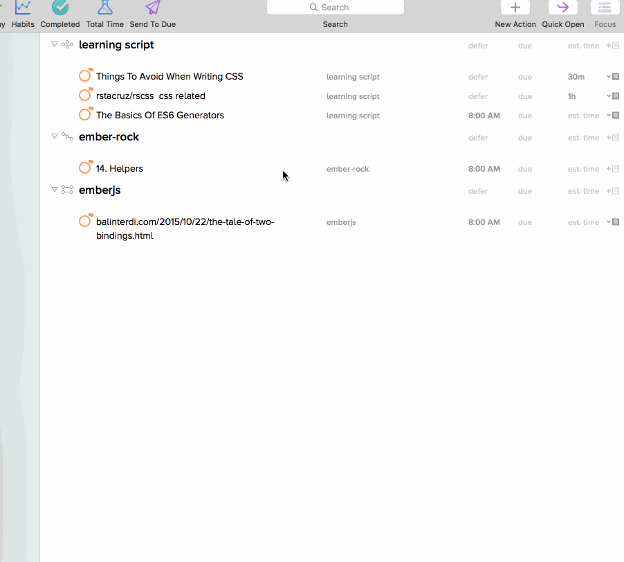

# mac-automation
Some scripts for improving efficiency

## Omnifocus & DUE

### What

Send all selected tasks from `Omnifocus 2` to `Mac Due App`

The default EST is 30 mins.

`if thisEstimate is missing value then set thisEstimate to 30`

### Demo

